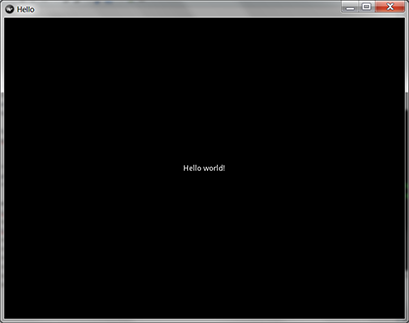
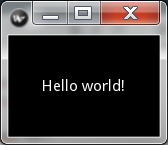

===============
Getting Started
===============

************
Install Kivy
************

- This tutorial is on Windows 7, Kivy 1.8.0, Python 2.7. Probably applies to other platforms/versions though.
- Kivy comes with Python 2.7, you don't need to install Python.
- Python 2 is the poor choice compared to Python 3. But Kivy can't build to Android with Python 3 yet. This tutorial will be updated *the second* that Kivy gets with the program.

#. Download *Kivy-1.8.0-py3.3-win32.zip* from http://kivy.org/#download
#. `Unzip <https://www.google.com/search?q=how%20to%20unzip%20files>`_ it to *C:\\kivy*. Another folder works too. This tutorial uses *C:\\kivy*.

***********************
Try Out Some Kivy Stuff
***********************

#. Press Win+R to open Run window. Enter ``C:\kivy\kivy.bat`` to open Kivy-specific command prompt.
#. Enter ``python kivy\examples\animation\animate.py`` and play with that program a bit.
#. Enter ``kivy kivy\examples\animation\animate.py`` and see that it does the same thing.
#. You can run the Kivy programs with kivy.bat or python.exe
#. Enter ``kivy kivy\examples\canvas\bezier.py`` and play with that program a bit.
#. Enter ``kivy kivy\examples\canvas\canvas_stress.py`` and play with that program a bit.
#. Enter ``kivy kivy\examples\canvas\circle.py`` and play with that program a bit.
#. Enter ``kivy kivy\examples\canvas\lines.py`` and play with that program a bit.
#. Enter ``kivy kivy\examples\shader\plasma.py`` and play with that program a bit.
#. Enter ``kivy kivy\examples\tutorials\pong\main.py`` and play with that program a bit.

***********
Hello World
***********

Open a new text file called *C:\kivy\hello.py* and enter the following::

    import kivy
    kivy.require('1.8.0')

    from kivy.app import App
    from kivy.uix.button import Label

    class HelloApp(App):
        def build(self):
            return Label(text='Hello world!')

    HelloApp().run()

To run this program:

#. Press Win+R to open Run window. Enter ``C:\kivy\kivy.bat`` to open Kivy-specific command prompt.
#. Enter ``kivy hello.py``

You can set the size of the window when you run this program:

#. Enter ``kivy hello.py -–size=150x100`` to make the window width 150 and height 100.

Code explanation::

    import kivy
    kivy.require('1.8.0')

The ``require()`` function raises an exception if the installed version of Kivy is not up to date enough::

    from kivy.app import App
    from kivy.uix.button import Label

    class HelloApp(App):
        def build(self):
            return Label(text='Hello world!')

The Kivy app is implemented as a subclass of ``kivy.app.App``. Kivy checks for a ``build()`` method and calls it to return the UI for the Kivy app. The ``HelloApp``'s ``build()`` method reutrns a text Label object with "Hello world!" as the text::

    HelloApp().run()

The ``run()`` method call starts the app.

*********
.kv Files
*********

Open a new text file called *C:\kivy\hello2.py* and enter the following::

    from kivy.app import App
    from kivy.uix.button import Label, Button

    class HelloTheSecondApp(App):
        def build(self):
            return Label()

    HelloTheSecondApp().run()

Create another text file called *C:\kivy\helloTheSecond.kv* and enter the following::

    <Label>:
      text: 'Hello world!'

To run this program:

#. Press Win+R to open Run window. Enter ``C:\kivy\kivy.bat`` to open Kivy-specific command prompt.
#. Enter ``kivy hello2.py``

- .kv files let you separate the presentation & UI from the code.
- Kivy knows to look in *helloTheSecond.kv* because the class's name is ``HelloTheSecondApp``.
- The syntax of these .kv files is ridiculous. I advise not using them.
